# Diagnóstico Arquitectónico AS-IS: Diagrama de Clases UML y Análisis Estructural

**Proyecto**: Sistema Farmacia Heredado (.NET 8)  
**Asignatura**: Arquitectura de Software (6to Semestre)  
**Ubicación del Artefacto**: `01-diagnostico/diagrama-as-is.md`  
**Fecha de Diagnóstico**: 2026-08-05  
**Autor**: Agente Especialista UML & Arquitectura Mermaid  

---

## 1. Resumen Ejecutivo

El presente documento constituye la representación formal y el análisis diagnóstico del **estado actual (AS-IS)** del sistema heredado `SolucionFarmacia`, compuesto por las librerías `BibFarmacia` (26 archivos `.cs`) y la aplicación de consola `AppFarmaciaConsola` (`Program.cs`, 378 líneas).

El diagrama UML expuesto a continuación captura fielmente la totalidad de los 27 componentes de software (clases concretas, abstractas, interfaces, enums, aspectos estáticos, fábricas, eventos y punto de entrada) con sus miembros reales (atributos, propiedades y métodos con símbolos de visibilidad UML `+` público, `-` privado, `#` protegido, `$` estático, `*` abstracto) y sus relaciones reales de herencia, realización, composición/agregación y dependencia.

---

## 2. Diagrama de Clases UML AS-IS (Mermaid)

```mermaid
classDiagram
    direction TB

    %% ==========================================
    %% DOMINIO: ENTIDADES Y JERARQUÍAS
    %% ==========================================

    class Persona {
        <<abstract>>
        +string Nombre
        +string Cedula
        +string Telefono
        +string Correo
        #Persona(string nombre, string cedula, string telefono, string correo)
    }

    class Cliente {
        +int Puntos
        +Cliente(string nombre, string cedula, string telefono, string correo)
        +AcumularPuntos(int puntos) void
    }

    class Usuario {
        +string UserName
        +string Password
        +Usuario(string nombre, string cedula, string telefono, string correo, string userName, string password)
    }

    class Laboratorio {
        +string Nombre
        +string Direccion
        +string Telefono
        +Laboratorio(string nombre, string direccion, string telefono)
    }

    class Producto {
        <<abstract>>
        +string Nombre
        +decimal Precio
        +int Stock
        +int StockMinimo
        +DateTime FechaVencimiento
        #Producto(string nombre, decimal precio, int stock, int stockMinimo, DateTime fechaVencimiento)
        +MostrarInformacion() void
    }

    class Medicamento {
        +Laboratorio Laboratorio
        +Medicamento(string nombre, decimal precio, int stock, int stockMinimo, DateTime fechaVencimiento, Laboratorio laboratorio)
    }

    class MedicamentoCapsula {
        +TipoRelleno TipoRelleno
        +MedicamentoCapsula(string nombre, decimal precio, int stock, int stockMinimo, DateTime fechaVencimiento, Laboratorio laboratorio, TipoRelleno tipoRelleno)
    }

    class MedicamentoLiquido {
        +MaterialEnvase MaterialEnvase
        +int Mililitros
        +MedicamentoLiquido(string nombre, decimal precio, int stock, int stockMinimo, DateTime fechaVencimiento, Laboratorio laboratorio, MaterialEnvase materialEnvase, int mililitros)
    }

    class Movimiento {
        +DateTime Fecha
        +int Cantidad
        +string Tipo
        +Producto Producto
        +Movimiento(DateTime fecha, int cantidad, string tipo, Producto producto)
    }

    %% ==========================================
    %% ENUMS Y FABRICAS
    %% ==========================================

    class MaterialEnvase {
        <<enum>>
        Vidrio
        Plastico
    }

    class TipoRelleno {
        <<enum>>
        Gel
        Polvo
    }

    class ProductoFactory {
        <<static>>
        +CrearCapsula(string nombre, decimal precio, int stock, Laboratorio laboratorio)$ MedicamentoCapsula
        +CrearLiquido(string nombre, decimal precio, int stock, Laboratorio laboratorio)$ MedicamentoLiquido
    }

    %% ==========================================
    %% ASPECTOS STATIC HELPER
    %% ==========================================

    class AspectoAutenticacion {
        <<static>>
        +Login(List~Usuario~ usuarios, string user, string password)$ bool
    }

    class AspectoValidacion {
        <<static>>
        +ValidarCliente(Cliente cliente)$ string
        +ValidarProducto(Producto producto)$ string
    }

    %% ==========================================
    %% EVENTOS DE INFRAESTRUCTURA
    %% ==========================================

    class EventoMovimiento {
        +DelegadoMovimiento MovimientoRegistrado
        +Disparar(string tipo) void
    }

    class EventoPuntos {
        +DelegadoPuntos PuntosAcumulados
        +Disparar(string cliente, int puntos) void
    }

    class EventoStockMinimo {
        +DelegadoStock StockMinimo
        +Disparar(Producto producto) void
    }

    class EventoVencimiento {
        +DelegadoVencimiento Vencimiento
        +Disparar(Producto producto) void
    }

    %% ==========================================
    %% INTERFACES
    %% ==========================================

    class IDescuento {
        <<interface>>
        +CalcularDescuento(decimal precio)* decimal
    }

    class IServicioNotificacion {
        <<interface>>
        +EnviarNotificacion(string mensaje)* void
    }

    %% ==========================================
    %% SERVICIOS CONCRETOS
    %% ==========================================

    class ServicioCliente {
        -List~Cliente~ clientes
        +EventoPuntos EventoPuntos
        +ServicioCliente()
        +AgregarCliente(Cliente cliente) void
        +ObtenerClientes() List~Cliente~
        +AcumularPuntos(Cliente cliente, int puntos) void
        +Cargar(string ruta) string
    }

    class ServicioDescuento {
        +CalcularDescuento(decimal precio) decimal
    }

    class ServicioMovimiento {
        -List~Movimiento~ movimientos
        +EventoMovimiento EventoMovimiento
        +ServicioMovimiento()
        +RegistrarMovimiento(Movimiento movimiento) void
        +ObtenerMovimientos() List~Movimiento~
    }

    class ServicioNotificacion {
        +EnviarNotificacion(string mensaje) void
    }

    class ServicioProducto {
        -List~Producto~ productos
        +EventoStockMinimo EventoStock
        +EventoVencimiento EventoVencimiento
        +ServicioProducto()
        +AgregarProducto(Producto producto) string
        +ObtenerProductos() List~Producto~
        +VerificarStock() void
        +VerificarVencimiento() void
        +CargarDesdeArchivo(string ruta) string
    }

    class ServicioUsuario {
        -List~Usuario~ usuarios
        +ServicioUsuario()
        +AgregarUsuario(Usuario usuario) void
        +Login(string user, string password) bool
        +Cargar(string ruta) string
    }

    %% ==========================================
    %% CONSOLA (PUNTO DE ENTRADA)
    %% ==========================================

    class Program {
        <<ConsoleApp>>
        -ServicioProducto servicioProducto
        -ServicioCliente servicioCliente
        -ServicioUsuario servicioUsuario
        -ServicioMovimiento servicioMovimiento
        +Main(string[] args) static
    }

    %% ==========================================
    %% RELACIONES
    %% ==========================================

    %% Herencia (Inheritance)
    Persona <|-- Cliente : Herencia
    Persona <|-- Usuario : Herencia
    Producto <|-- Medicamento : Herencia
    Medicamento <|-- MedicamentoCapsula : Herencia
    Medicamento <|-- MedicamentoLiquido : Herencia

    %% Realización de Interfaces (Realization)
    IDescuento <|.. ServicioDescuento : Implementa
    IServicioNotificacion <|.. ServicioNotificacion : Implementa

    %% Asociaciones y Agregaciones/Composiciones de Dominio
    Medicamento "0..*" o-- "1" Laboratorio : pertenece a
    MedicamentoCapsula --> TipoRelleno : usa enum
    MedicamentoLiquido --> MaterialEnvase : usa enum
    Movimiento "0..*" o-- "1" Producto : referencia

    %% Composición / Agregación en Servicios
    ServicioCliente "1" *-- "0..*" Cliente : almacena en memoria
    ServicioCliente "1" *-- "1" EventoPuntos : instancia/expone campo
    ServicioProducto "1" *-- "0..*" Producto : almacena en memoria
    ServicioProducto "1" *-- "1" EventoStockMinimo : instancia/expone campo
    ServicioProducto "1" *-- "1" EventoVencimiento : instancia/expone campo
    ServicioUsuario "1" *-- "0..*" Usuario : almacena en memoria
    ServicioMovimiento "1" *-- "0..*" Movimiento : almacena en memoria
    ServicioMovimiento "1" *-- "1" EventoMovimiento : instancia/expone campo

    %% Dependencias de Fábricas y Aspectos (Dependencies)
    ProductoFactory ..> MedicamentoCapsula : crea con new
    ProductoFactory ..> MedicamentoLiquido : crea con new
    ProductoFactory ..> Laboratorio : requiere
    ProductoFactory ..> TipoRelleno : requiere
    ProductoFactory ..> MaterialEnvase : requiere

    AspectoAutenticacion ..> Usuario : filtra colección
    AspectoValidacion ..> Cliente : valida estado
    AspectoValidacion ..> Producto : valida estado

    EventoStockMinimo ..> Producto : pasa parámetro
    EventoVencimiento ..> Producto : pasa parámetro

    ServicioUsuario ..> AspectoAutenticacion : invoca login estático
    ServicioProducto ..> Laboratorio : instancia en CargarDesdeArchivo
    ServicioProducto ..> MedicamentoCapsula : instancia en CargarDesdeArchivo

    %% Dependencias de la Capa de Consola (Program.cs)
    Program --> ServicioProducto : instancia (new) & invoca
    Program --> ServicioCliente : instancia (new) & invoca
    Program --> ServicioUsuario : instancia (new) & invoca
    Program --> ServicioMovimiento : instancia (new) & invoca
    Program ..> Movimiento : instancia venta (new)
    Program ..> Producto : muta stock directamente (p.Stock -= n)
```



---

## 3. Análisis Arquitectónico Detallado del Diagrama AS-IS

El análisis estático de la estructura UML revela importantes cuellos de botella y fallas de diseño en todas las capas del sistema.

### 3.1 Estructura del Modelo de Dominio y Rigidez de Jerarquías

1. **Jerarquía Monolítica en `Producto` (Acoplamiento de Atributos Físicos)**:
   - `Producto` (clase abstracta base) impone `Stock`, `StockMinimo` y `FechaVencimiento` a **todas** sus subclases.
   - `Medicamento` extiende `Producto` agregando obligatoriamente una referencia a `Laboratorio`.
   - **Falla Arquitectónica**: Esta jerarquía fuerza la suposición de que todo elemento vendible es un medicamento farmacéutico perecedero producido por un laboratorio. No existen interfaces segregadas como `IVendible`, `IStockable` o `IPerishable`.

2. **Pérdida de Polimorfismo en `MostrarInformacion()`**:
   - `Producto.MostrarInformacion()` se define como `virtual` imprimiendo solo `Nombre`, `Precio` y `Stock`.
   - Ni `Medicamento`, ni `MedicamentoCapsula`, ni `MedicamentoLiquido` sobrescriben este método. Invocarlo sobre una cápsula o un líquido pierde información crítica del subtipo (`Laboratorio`, `TipoRelleno`, `MaterialEnvase`, `Mililitros`).

3. **Invariantes No Validadas**:
   - `Cliente.AcumularPuntos(int puntos)` realiza `Puntos += puntos` sin validar si `puntos > 0`, permitiendo la disminución arbitraria o corrupción del balance de puntos del cliente.

---

### 3.2 Capa de Servicios: Servicios Monolíticos ("Fat Services") e I/O Acoplado

1. **Ausencia Total de Interfaces de Servicio**:
   - De los 6 servicios concretos (`ServicioCliente`, `ServicioProducto`, `ServicioUsuario`, `ServicioMovimiento`, `ServicioDescuento`, `ServicioNotificacion`), únicamente 2 (`ServicioDescuento` y `ServicioNotificacion`) implementan interfaces (`IDescuento`, `IServicioNotificacion`).
   - Los 4 servicios principales no implementan interfaces (`IServicioCliente`, `IServicioProducto`, etc.) ni admiten inyección de dependencias (DI).

2. **Mezcla de Lógica de Negocio con Lectura de Archivos CSV**:
   - `ServicioCliente.Cargar(string ruta)`, `ServicioUsuario.Cargar(string ruta)` y `ServicioProducto.CargarDesdeArchivo(string ruta)` invocan directamente `File.Exists` y `File.ReadAllLines`, realizando `linea.Split(';')` e instanciando entidades en el servicio de negocio.
   - **Violación SRP/DIP**: Impide migrar la persistencia a base de datos, servicio web o repositorio en memoria sin modificar las clases de servicio.

3. **Datos Quemados ("Hardcoded") en `ServicioProducto.CargarDesdeArchivo`**:
   - Al parsear el archivo CSV de productos, `ServicioProducto` instancian arbitrariamente:
     ```csharp
     Laboratorio laboratorio = new Laboratorio(datos[5], "Medellin", "4444444");
     MedicamentoCapsula medicamento = new MedicamentoCapsula(..., Enum.TipoRelleno.Gel);
     ```
   - Inventa valores de ubicación, teléfono y tipo de relleno, e instancian obligatoriamente `MedicamentoCapsula`, imposibilitando la carga de líquidos o de otros productos.

4. **Descuento Fijo Hardcodeado**:
   - `ServicioDescuento.CalcularDescuento(decimal precio)` retorna `precio * 0.10m` fijo. No admite convenios, reglas dinámicas o estrategias por cliente (SC-3).

---

### 3.3 El "God Script" de Consola (`Program.cs`) y Violaciones de Encapsulamiento

1. **Acumulación de Responsabilidades en Top-Level Statements**:
   - `Program.cs` (378 líneas) actúa como un script monolítico que asume 7 responsabilidades:
     1. Configuración y formateo estético de interfaz de usuario (`Console.ForegroundColor`).
     2. Lectura y conversión de inputs por consola (`int.Parse(Console.ReadLine()!)`).
     3. Orquestación del ciclo de vida (Carga → Login → Menú → Salida).
     4. Consultas LINQ escritas directamente en las cláusulas `case` (`ObtenerProductos().FirstOrDefault(...)`).
     5. Mutación directa de estado de entidades (`productoVenta.Stock -= cantidad;`).
     6. Instanciación con `new` de servicios y objetos transaccionales (`new Movimiento(...)`).
     7. Rutas físicas de archivos quemadas (`"productos.txt"`, `"clientes.txt"`, `"usuarios.txt"`).

2. **Violación de Encapsulamiento de Inventario**:
   - En el `case 4` (Registrar venta), `Program.cs` ejecuta `productoVenta.Stock -= cantidad;` directamente sobre la propiedad del producto en la vista UI, saltándose el servicio de dominio y cualquier regla de validación de stock negativo.

3. **Instanciación Rígida sin Inyección de Dependencias (DIP)**:
   - `Program.cs` instancian directamente mediante `new`: `ServicioProducto`, `ServicioCliente`, `ServicioUsuario`, `ServicioMovimiento`. Imposible automatizar pruebas unitarias o simular dependencias.

---

### 3.4 Infraestructura de Eventos y "Aspectos" Estáticos

1. **Campos Públicos Mutables para Eventos**:
   - Los servicios exponen eventos como campos públicos concretos:
     - `ServicioCliente.EventoPuntos` (`public EventoPuntos EventoPuntos;`)
     - `ServicioProducto.EventoStock` (`public EventoStockMinimo EventoStock;`)
     - `ServicioProducto.EventoVencimiento` (`public EventoVencimiento EventoVencimiento;`)
     - `ServicioMovimiento.EventoMovimiento` (`public EventoMovimiento EventoMovimiento;`)
   - Cualquier cliente externo puede sobreescribir la instancia entera del evento (`servicioCliente.EventoPuntos = null;`), rompiendo las suscripciones del sistema.

2. **Falsos "Aspectos" Estáticos**:
   - `AspectoAutenticacion` y `AspectoValidacion` son declarados como clases estáticas `public static class`.
   - No utilizan AOP (Aspect-Oriented Programming) real ni interceptores. Son simples helpers estáticos fuertemente acoplados a `List<Usuario>`, `Cliente` y `Producto`.
   - `AspectoValidacion` retorna `string` con mensajes en español ("Cliente válido", "Precio inválido") en lugar de un objeto de resultado de validación estructurado.

3. **Formateo de Mensajes dentro de Clases de Evento**:
   - `EventoStockMinimo.Disparar` y `EventoVencimiento.Disparar` construyen strings formateados (`"ALERTA: stock mínimo de ..."`), mezclando la notificación de eventos con la presentación UI.

---

## 4. Matriz de Trazabilidad: Componentes vs Principios SOLID Comprometidos

| Componente UML | Tipo | Responsabilidad Declarada | Violaciones SOLID Principales | Impacto en el Sistema |
|---|---|---|---|---|
| `Persona` | `abstract class` | Clase base para personas | Ninguna (Cumple) | Base adecuada de identidad. |
| `Cliente` | `class` | Entidad de cliente y puntos | **LSP** (`AcumularPuntos` admite negativos) | Posible corrupción de puntos. |
| `Usuario` | `class` | Entidad de usuario | Ninguna (Cumple) | Entidad de datos pura. |
| `Laboratorio` | `class` | Entidad de fabricante | Ninguna (Cumple) | Entidad de datos pura. |
| `Producto` | `abstract class` | Clase base de catálogo | **SRP, OCP, LSP, ISP** | Obliga stock, vencimiento y `Console.WriteLine` a todo elemento. |
| `Medicamento` | `class` | Fármaco | **OCP, LSP** | Exige `Laboratorio` a todo producto. |
| `MedicamentoCapsula` | `class` | Fármaco en cápsulas | **OCP** (No sobrescribe `MostrarInformacion`) | Pérdida de detalles en salidas polimórficas. |
| `MedicamentoLiquido` | `class` | Fármaco líquido | **OCP** (No sobrescribe `MostrarInformacion`) | Pérdida de detalles en salidas polimórficas. |
| `Movimiento` | `class` | Transacción de inventario | **DIP** (Depende de clase concreta `Producto`) | No permite movimientos de servicios o intangibles. |
| `MaterialEnvase` | `enum` | Enumeración de envases | **DIP / Naming** (Namespace `BibFarmacia.Enum`) | Inconsistencia de namespaces. |
| `TipoRelleno` | `enum` | Enumeración de rellenos | **DIP / Naming** (Namespace `BibFarmacia.Enum`) | Inconsistencia de namespaces. |
| `ProductoFactory` | `static class` | Fábrica de medicamentos | **SRP, OCP, DIP** | Valora por defecto stock=5, vence=6/12 meses, relleno=Gel, envase=Vidrio. |
| `AspectoAutenticacion` | `static class` | Helper de login | **SRP, DIP** (Acoplado a `List<Usuario>`) | Impide cambiar estrategia de login o fuente de datos. |
| `AspectoValidacion` | `static class` | Helper de validaciones | **SRP, OCP** (Combina `Cliente` y `Producto`) | Modificar una validación afecta a la otra. Retorna strings UI. |
| `EventoMovimiento` | `class` | Publicador de movimiento | **SRP** (Formatea string en `Disparar`) | Formateo rígido de texto. |
| `EventoPuntos` | `class` | Publicador de puntos | **SRP** (Formatea string en `Disparar`) | Formateo rígido de texto. |
| `EventoStockMinimo` | `class` | Publicador de alertas stock | **SRP, ISP** (Toma `Producto` completo para leer `Nombre`) | No reutilizable para otros insumos. |
| `EventoVencimiento` | `class` | Publicador de alertas vencimiento | **SRP, ISP** (Toma `Producto` completo para leer `Nombre`) | No reutilizable para otros insumos. |
| `IDescuento` | `interface` | Contrato de descuento | **Cumple (SRP, ISP)** | Interfaz cohesiva de 1 solo método. |
| `IServicioNotificacion` | `interface` | Contrato de notificación | **Cumple (SRP, ISP)** | Interfaz cohesiva de 1 solo método. |
| `ServicioCliente` | `class` | Servicio de clientes | **SRP, DIP** (File I/O, `new List`, `new Evento`) | Acoplado a disco CSV y eventos concretos. |
| `ServicioDescuento` | `class` | Implementación descuento | **OCP** (Retorna 10% fijo hardcodeado) | No admite convenios ni reglas dinámicas. |
| `ServicioMovimiento` | `class` | Servicio de transacciones | **DIP** (Campos públicos concretos) | Acoplado a eventos de infraestructura. |
| `ServicioNotificacion` | `class` | Notificador consola | **DIP** (Depende de `Console.WriteLine`) | No admite Email, SMS o archivo log. |
| `ServicioProducto` | `class` | Servicio de productos | **SRP, OCP, DIP** (File I/O, datos quemados, `MedicamentoCapsula`) | Solo soporta cápsulas CSV, acoplado a archivos. |
| `ServicioUsuario` | `class` | Servicio de usuarios | **SRP, DIP** (File I/O, `AspectoAutenticacion`) | Acoplado a disco CSV y llamada estática. |
| `Program` | `ConsoleApp` | Punto de entrada UI | **SRP, OCP, LSP, ISP, DIP** ("God Script") | 378 líneas con 7 responsabilidades, sin DI. |

---

## 5. Evaluación de Extensibilidad ante Solicitudes de Cambio (SC-1, SC-2, SC-3)

La evaluación de la arquitectura AS-IS expuesta en el diagrama contra los requerimientos de cambio futuros evidencia la incapacidad del sistema actual para evolucionar sin reescrituras masivas:

```
                                  SISTEMA ACTUAL (AS-IS)
                                            │
         ┌──────────────────────────────────┼──────────────────────────────────┐
         ▼                                  ▼                                  ▼
   [ SC-1: Comestibles ]              [ SC-2: Servicios ]               [ SC-3: Convenios ]
   (Gaseosas, Snacks, Cosméticos)     (Inyectología, Curaciones)        (Empresas, Bancos, Mutuales)
         │                                  │                                  │
 ✖ Obliga a tener `Laboratorio`     ✖ Obliga a tener `Stock` y         ✖ `ServicioDescuento` tiene
   o exige cambiar base `Producto`    `FechaVencimiento`                 10% fijo hardcodeado
 ✖ `ProductoFactory` solo sabe      ✖ `productoVenta.Stock -= n`      ✖ `Cliente` solo posee `Puntos`
   crear Cápsulas y Líquidos          fallará semánticamente            sin referencia a Entidades
 ✖ `ServicioProducto` hardcodea     ✖ `VerificarStock` alertará       ✖ Menú en `Program.cs` no
   `MedicamentoCapsula` en CSV        0 stock para servicios             soporta selección de convenio
```

### Resumen de Impacto Técnico por Solicitud de Cambio

1. **SC-1 (Productos Cosméticos y Comestibles)**:
   - Archivos a modificar: `Producto.cs`, `Medicamento.cs`, `ProductoFactory.cs`, `ServicioProducto.cs`, `Program.cs`.
   - Riesgo de ruptura: Alto. Forzar la herencia de `Medicamento` exige crear un `Laboratorio` falso o hacer la propiedad nula. `ProductoFactory` no soporta nuevos tipos de producto.

2. **SC-2 (Venta de Servicios de Salud: Inyectología, Curaciones)**:
   - Archivos a modificar: `Producto.cs`, `Movimiento.cs`, `ServicioProducto.cs`, `Program.cs`.
   - Riesgo de ruptura: Muy Alto. Los servicios no poseen stock ni vencimiento. Heredar de `Producto` provoca violaciones de LSP (alertas falsas de stock=0 y excepciones en fechas).

3. **SC-3 (Convenios y Descuentos Especiales con Entidades)**:
   - Archivos a modificar: `Cliente.cs`, `ServicioDescuento.cs`, `IDescuento.cs`, `Program.cs`.
   - Riesgo de ruptura: Medio/Alto. `ServicioDescuento` debe ser reconstruido con el patrón Strategy, y `Program.cs` debe adaptar su menú de ventas para solicitar la entidad del convenio.

---

## 6. Recomendaciones de Rediseño Arquitectónico (TO-BE)

Para transformar la arquitectura actual en un sistema mantenible, extensible y alineado 100% con SOLID:

1. **Segregación de Interfaces de Dominio**:
   - Reemplazar la jerarquía rígida de `Producto` con interfaces compuestas:
     - `IVendible` (`Nombre`, `Precio`)
     - `IInventariable : IVendible` (`Stock`, `StockMinimo`)
     - `IPerishable : IVendible` (`FechaVencimiento`)
     - `IFarmaceutico : IPerishable` (`Laboratorio`)

2. **Capa de Persistencia y Repositorios (DIP)**:
   - Mover el código `File.ReadAllLines` fuera de los servicios a repositorios concretos:
     - `IProductoRepository`, `IClienteRepository`, `IUsuarioRepository`.
     - Implementaciones: `CsvProductoRepository`, `CsvClienteRepository`, etc.

3. **Inyección de Dependencias (DI) Container**:
   - Configurar `Microsoft.Extensions.DependencyInjection` en `Program.cs` para registrar servicios, repositorios y escuchadores de eventos con ciclo de vida adecuado (`Singleton`, `Transient`, `Scoped`).

4. **Patrón Strategy para Descuentos (SC-3)**:
   - Refactorizar `IDescuento` e implementar `IDescuentoStrategy` (`DescuentoGeneralStrategy`, `DescuentoConvenioStrategy`, `DescuentoClienteFrecuenteStrategy`).

5. **Fábrica Polimórfica y Deserialización de Productos (SC-1)**:
   - Reemplazar los métodos estáticos de `ProductoFactory` con una fábrica abstracta o registro de creadores por tipo (`IProductoFactory`).

6. **Desacoplamiento de la Interfaz de Consola (`Program.cs`)**:
   - Degradado de `Program.cs` a un controlador UI delgado, abstrayendo vistas (`IConsoleView`) y comandos del menú (`IMenuCommand`).
