# Mapa de Dependencias del Sistema AS-IS (`SolucionFarmacia`)

**Módulo**: Diagnóstico AS-IS (Fase 1 — Requerimiento R4)  
**Proyecto**: SolucionFarmacia (`BibFarmacia` y `AppFarmaciaConsola`)  
**Autor**: Agente Mapa de Dependencias (`worker_dep_m3`)  
**Fecha**: 2026-08-05  
**Ubicación del Documento**: `01-diagnostico/mapa-dependencias.md`  

---

## 1. Clasificación de Módulos: Alto Nivel vs. Bajo Nivel

El **Principio de Inversión de Dependencias (DIP)** establece que *los módulos de alto nivel no deben depender de módulos de bajo nivel; ambos deben depender de abstracciones*. Para evaluar rigurosamente el grado de acoplamiento del sistema heredado `SolucionFarmacia`, es necesario clasificar formalmente todos los componentes del sistema según su nivel de abstracción y proximidad a las reglas de negocio vs. detalles de infraestructura.

### 1.1 Definición Conceptual

*   **Módulos de Alto Nivel**: Contienen las políticas de negocio, las reglas de dominio, las entidades conceptuales y la orquestación del flujo de la aplicación. Son los componentes que justifican la existencia del software y no deberían ser afectados si cambia el medio de almacenamiento, el framework de interfaz o los dispositivos de entrada/salida.
*   **Módulos de Bajo Nivel**: Contienen los detalles técnicos de implementación, infraestructura, mecanismos de entrada/salida (I/O), llamadas a APIs del sistema operativo, acceso a archivos físicos, consolas de texto, aspectos estáticos de soporte e instanciación concreta (factories rígidas).

---

### 1.2 Tabla de Clasificación de Componentes de la Solución

| Componente / Clase | Nivel | Categoría Arquitectónica | Justificación de Clasificación |
|---|---|---|---|
| `ServicioProducto` | **Alto Nivel** | Servicio de Aplicación / Dominio | Encapsula reglas de negocio para consulta de productos, validación de stock mínimo y control de vencimiento. |
| `ServicioCliente` | **Alto Nivel** | Servicio de Aplicación / Dominio | Maneja la gestión de clientes y la acumulación de puntos de fidelización de la farmacia. |
| `ServicioUsuario` | **Alto Nivel** | Servicio de Aplicación / Dominio | Maneja la colección de usuarios del sistema y la orquestación de autenticación. |
| `ServicioMovimiento` | **Alto Nivel** | Servicio de Aplicación / Dominio | Administra el registro transaccional de ventas y movimientos de inventario. |
| `ServicioDescuento` | **Alto Nivel** | Servicio de Aplicación / Dominio | Calcula las políticas de descuento aplicables sobre los productos comercializados. |
| `Persona` | **Alto Nivel** | Entidad de Dominio (Abstracta) | Clase base conceptual para actores del sistema (`Nombre`, `Cedula`, `Telefono`, `Correo`). |
| `Cliente` | **Alto Nivel** | Entidad de Dominio | Entidad que representa a un comprador con su saldo de puntos. |
| `Usuario` | **Alto Nivel** | Entidad de Dominio | Entidad que representa a un operador del sistema con credenciales. |
| `Producto` | **Alto Nivel** | Entidad de Dominio (Abstracta) | Representación conceptual de un artículo vendible (`Nombre`, `Precio`, `Stock`). |
| `Medicamento` | **Alto Nivel** | Entidad de Dominio (Abstracta) | Especialización de producto farmacéutico con `StockMinimo`, `FechaVencimiento` y `Laboratorio`. |
| `MedicamentoCapsula` | **Alto Nivel** | Entidad de Dominio Concreta | Subclase concreta con atributo específico `TipoRelleno`. |
| `MedicamentoLiquido` | **Alto Nivel** | Entidad de Dominio Concreta | Subclase concreta con atributos de `MaterialEnvase` y `ContenidoMl`. |
| `Laboratorio` | **Alto Nivel** | Entidad de Dominio | Entidad secundaria que representa la casa farmacéutica fabricante. |
| `Movimiento` | **Alto Nivel** | Entidad de Dominio / Transacción | Entidad que encapsula un evento de venta o ajuste de inventario. |
| `IDescuento` | **Alto Nivel** | Abstracción de Interfaz | Contrato para cálculo de descuentos de negocio. |
| `IServicioNotificacion` | **Alto Nivel** | Abstracción de Interfaz | Contrato para envío de alertas y notificaciones del sistema. |
| `Program.cs` (Flujo UI) | **Alto Nivel** | Orquestador de Aplicación | Contiene la intención de casos de uso y coordinación entre servicios de negocio. |
| `System.IO.File` / CSV | **Bajo Nivel** | Infraestructura / Persistencia | Acceso directo al sistema de archivos del SO (`ReadAllLines`, `Exists`, parsing `;`). |
| `System.Console` | **Bajo Nivel** | Infraestructura / Interfaz I/O | Dispositivo de salida por pantalla y entrada de teclado (`WriteLine`, `ReadLine`). |
| `AspectoAutenticacion` | **Bajo Nivel** | Aspecto Estático de Soporte | Método estático `Login` acoplado a `List<Usuario>`. |
| `AspectoValidacion` | **Bajo Nivel** | Aspecto Estático de Soporte | Métodos estáticos de validación de sintaxis de cliente y producto. |
| `ProductoFactory` | **Bajo Nivel** | Fábrica Concreta Estática | Creación rígida de objetos con valores hardcodeados de relleno, envase y fechas. |
| `System.DateTime.Now` | **Bajo Nivel** | Detalle de Infraestructura / SO | Invocación al reloj interno del sistema operativo. |
| Archivos `.txt` | **Bajo Nivel** | Infraestructura / Almacenamiento | Rutas relativas quemadas (`"productos.txt"`, `"clientes.txt"`, `"usuarios.txt"`). |
| Clases de Eventos | **Bajo Nivel** | Infraestructura de Eventos | Eventos concretos de infraestructura (`EventoMovimiento`, `EventoPuntos`, etc.). |

---

## 2. Mapa Detallado de Dependencias Concretas (AS-IS)

En la solución actual, los módulos de alto nivel dependen de forma **directa, rígida y explícita** de los módulos de bajo nivel. A continuación se detallan los tres vectores principales de acoplamiento concreto identificados en el código.

```
+-----------------------------------------------------------------------------------+
|                                 Program.cs (UI)                                  |
+-----------------------------------------------------------------------------------+
       |                    |                    |                    |
       | new                | new                | new                | new
       v                    v                    v                    v
+------------------+ +------------------+ +------------------+ +------------------+
| ServicioProducto | |  ServicioCliente | |  ServicioUsuario | |ServicioMovimiento|
+------------------+ +------------------+ +------------------+ +------------------+
       |                    |                    |                    |
       | File.ReadAllLines  | File.ReadAllLines  | File.ReadAllLines  | new
       | new Laboratorio    | new EventoPuntos   | AspectoAutentic.  | EventoMovimiento
       | new MedCapsula     |                    |                    |
       v                    v                    v                    v
+-----------------------------------------------------------------------------------+
|                    Detalles de Bajo Nivel e Infraestructura                       |
|   (System.IO, System.Console, System.DateTime.Now, Archivos .txt, Clases Static)  |
+-----------------------------------------------------------------------------------+
```

---

### 2.1 Instanciaciones Concretas con la Palabra Clave `new`

La instanciación directa mediante `new` impide la inyección de dependencias y fuerza a una clase emisora a conocer la implementación exacta de la clase receptora.

| Clase Emisora (Alto Nivel) | Clase Instanciada con `new` | Ubicación Exacta (Archivo y Línea) | Consecuencia Arquitectónica |
|---|---|---|---|
| `Program.cs` | `ServicioProducto` | `Program.cs:8-9` | No se puede sustituir por un `IProductoService` mock o con caché. |
| `Program.cs` | `ServicioCliente` | `Program.cs:11-12` | No se puede inyectar un servicio de clientes persistido en BD. |
| `Program.cs` | `ServicioUsuario` | `Program.cs:14-15` | Imposibilita cambiar el servicio de autenticación/usuarios. |
| `Program.cs` | `ServicioMovimiento` | `Program.cs:17-18` | Acoplamiento rígido en la capa de interfaz. |
| `Program.cs` | `Movimiento` | `Program.cs:283-288` | La UI crea manualmente transacciones de dominio al vender. |
| `ServicioCliente` | `List<Cliente>` | `ServicioCliente.cs:20` | Estructura de almacenamiento rígida en memoria. |
| `ServicioCliente` | `EventoPuntos` | `ServicioCliente.cs:22` | Acoplado a la clase concreta de evento de puntos. |
| `ServicioCliente` | `Cliente` | `ServicioCliente.cs:66-70` | El servicio asume la construcción al parsear CSV. |
| `ServicioProducto` | `List<Producto>` | `ServicioProducto.cs:21` | Estructura en memoria no abstraída. |
| `ServicioProducto` | `EventoStockMinimo` | `ServicioProducto.cs:23` | Acoplado a la clase concreta de alerta de stock. |
| `ServicioProducto` | `EventoVencimiento` | `ServicioProducto.cs:24` | Acoplado a la clase concreta de alerta de fecha. |
| `ServicioProducto` | `Laboratorio` | `ServicioProducto.cs:93-97` | Instancia laboratorio hardcodeando `"Medellin"` y `"4444444"`. |
| `ServicioProducto` | `MedicamentoCapsula` | `ServicioProducto.cs:99-107` | Restringe la carga de productos únicamente a cápsulas de Gel. |
| `ServicioUsuario` | `List<Usuario>` | `ServicioUsuario.cs:20` | Estructura en memoria no abstraída. |
| `ServicioUsuario` | `Usuario` | `ServicioUsuario.cs:61-67` | Construcción directa de usuarios al parsear CSV. |
| `ServicioMovimiento`| `List<Movimiento>` | `ServicioMovimiento.cs:19` | Lista concreta en memoria. |
| `ServicioMovimiento`| `EventoMovimiento` | `ServicioMovimiento.cs:21` | Acoplado al evento concreto de movimiento. |
| `ProductoFactory` | `MedicamentoCapsula` | `ProductoFactory.cs:19-26` | Fábrica estática retorna tipo concreto de cápsula. |
| `ProductoFactory` | `MedicamentoLiquido` | `ProductoFactory.cs:34-42` | Fábrica estática retorna tipo concreto líquido. |

---

### 2.2 Invocaciones a Métodos Estáticos y APIs de Infraestructura

Las invocaciones estáticas rompen la posibilidad de interceptar, envolver o simular (mockear) llamadas en pruebas unitarias automatizadas.

| Clase / Módulo | Invocación Estática / API del SO | Ubicación (Archivo / Líneas) | Tipo de Acoplamiento |
|---|---|---|---|
| `ServicioUsuario` | `AspectoAutenticacion.Login(...)` | `ServicioUsuario.cs:31` | Acoplamiento estático a clase de infraestructura de autenticación. |
| `ServicioCliente` | `File.Exists(ruta)` | `ServicioCliente.cs:52` | Acoplamiento directo a `System.IO` (Sistema de archivos). |
| `ServicioCliente` | `File.ReadAllLines(ruta)` | `ServicioCliente.cs:58` | Acoplamiento directo a I/O de disco físico. |
| `ServicioProducto` | `File.Exists(ruta)` | `ServicioProducto.cs:80` | Acoplamiento directo a `System.IO`. |
| `ServicioProducto` | `File.ReadAllLines(ruta)` | `ServicioProducto.cs:86` | Acoplamiento directo a I/O de disco físico. |
| `ServicioProducto` | `DateTime.Now` | `ServicioProducto.cs:65` | Acoplamiento al reloj interno del SO (Pruebas no deterministas). |
| `ServicioUsuario` | `File.Exists(ruta)` | `ServicioUsuario.cs:42` | Acoplamiento directo a `System.IO`. |
| `ServicioUsuario` | `File.ReadAllLines(ruta)` | `ServicioUsuario.cs:48` | Acoplamiento directo a I/O de disco físico. |
| `ServicioNotificacion`| `Console.WriteLine(...)` | `ServicioNotificacion.cs:14` | Acoplamiento rígido a la consola de pantalla. |
| `ProductoFactory` | `DateTime.Now.AddMonths(6)` | `ProductoFactory.cs:24` | Invocación al reloj del SO (Imposibilita aserciones exactas). |
| `ProductoFactory` | `DateTime.Now.AddMonths(12)`| `ProductoFactory.cs:39` | Invocación al reloj del SO. |
| `Program.cs` | `Console.WriteLine / ReadLine` | `Program.cs: L20-378` (Múltiples) | Acoplamiento total del orquestador a la interfaz de consola física. |

---

### 2.3 Acoplamiento a Rutas y Archivos Hardcodeados

Los nombres y rutas relativas de los archivos de datos están incrustados directamente ("quemados") en las llamadas del punto de entrada `Program.cs`:

*   `"productos.txt"` en `Program.cs:79` (`servicioProducto.CargarDesdeArchivo("productos.txt")`)
*   `"clientes.txt"` en `Program.cs:83` (`servicioCliente.Cargar("clientes.txt")`)
*   `"usuarios.txt"` en `Program.cs:87` (`servicioUsuario.Cargar("usuarios.txt")`)

**Impacto**: Si la aplicación se ejecuta desde un directorio de trabajo (CWD) diferente a `AppFarmaciaConsola/`, o si se desea cambiar el origen de datos a un entorno de pruebas (`productos_test.txt`) o a una Base de Datos SQL, el programa falla inmediatamente o requiere recompilación.

---

## 3. Análisis de Inversión de Dependencias (DIP) Hoy (AS-IS)

---

### 3.1 Dónde SÍ se Aplica DIP Sintácticamente

En la solución heredada existen **únicamente dos interfaces** declaradas que sugieren la intención de aplicar inversión de dependencias:

1.  `IDescuento` (`BibFarmacia/Interfaces/IDescuento.cs`):
    ```csharp
    namespace BibFarmacia.Interfaces
    {
        public interface IDescuento
        {
            decimal CalcularDescuento(decimal precio);
        }
    }
    ```
    *   Implementada por: `ServicioDescuento` (`public class ServicioDescuento : IDescuento`).

2.  `IServicioNotificacion` (`BibFarmacia/Interfaces/IServicioNotificacion.cs`):
    ```csharp
    namespace BibFarmacia.Interfaces
    {
        public interface IServicioNotificacion
        {
            void EnviarNotificacion(string mensaje);
        }
    }
    ```
    *   Implementada por: `ServicioNotificacion` (`public class ServicioNotificacion : IServicioNotificacion`).

---

### 3.2 Por Qué la Inversión Sintáctica NO es Inversión Real

Aunque `ServicioDescuento` y `ServicioNotificacion` heredan sintácticamente de `IDescuento` e `IServicioNotificacion`, la arquitectura **NO aplica DIP en la práctica**:

1.  **Ausencia Total de Consumo por Interfaz**:
    *   `Program.cs` ni siquiera instancia ni utiliza `ServicioDescuento` o `IDescuento`. El cálculo del 10% de descuento no se inyecta en ninguna parte del flujo de ventas.
    *   `ServicioNotificacion` no es inyectado en `ServicioProducto` ni en `ServicioCliente`. Cuando los servicios detectan stock mínimo o acumulan puntos, no invocan a `IServicioNotificacion`, sino que disparan delegados de eventos concretos que `Program.cs` escucha para imprimir directamente en pantalla.
2.  **Acoplamiento Interno a Bajo Nivel en la Implementación**:
    *   `ServicioNotificacion` implementa `IServicioNotificacion`, pero internamente ejecuta `Console.WriteLine(...)`. Por lo tanto, el detalle de bajo nivel (Consola) sigue estando amarrado a la implementación sin permitir inyectar un *Sink* o proveedor de logs abstracto (`ILogger`).
3.  **Falta de Contenedor IoC / Inyección de Dependencias (DI)**:
    *   No existe un mecanismo (`IServiceCollection`, `Autofac`, `NInject`) que registre y resuelva `IServicioNotificacion` o `IDescuento`.

---

### 3.3 Dónde NO se Aplica DIP en Absoluto

En el **95% restante de la solución**, el principio DIP es ignorado por completo:

```
[ Alto Nivel: ServicioProducto ] ──(Depende directamente de)──> [ Bajo Nivel: System.IO.File ]
[ Alto Nivel: ServicioCliente ]  ──(Depende directamente de)──> [ Bajo Nivel: System.IO.File ]
[ Alto Nivel: ServicioUsuario ]  ──(Depende directamente de)──> [ Bajo Nivel: AspectoAutenticacion (Static) ]
[ Alto Nivel: Program.cs ]       ──(Depende directamente de)──> [ Concretos: ServicioProducto, ServicioCliente... ]
```

*   **Ninguno de los 4 servicios principales** (`ServicioProducto`, `ServicioCliente`, `ServicioUsuario`, `ServicioMovimiento`) implementa una interfaz (`IServicioProducto`, etc.).
*   **Ninguna operación de persistencia** está aislada tras una interfaz de repositorio (`IProductoRepository`, `IClienteRepository`, `IUsuarioRepository`).
*   **Ninguna invocación al reloj** está aislada tras una abstracción (`IDateTimeProvider`).
*   **Ningún evento de infraestructura** está abstraído tras un bus de eventos (`IEventBus`).

---

## 4. Matriz de Dependencias Directas

### 4.1 Matriz Origen vs. Destino

La siguiente matriz muestra de qué componentes concretos o tecnologías de bajo nivel depende cada clase del sistema actual.

| Clase / Módulo Origen | `Persona` / Entidades | `IDescuento` / `IServNotif` | `Servicios` Concretos | `AspectoAutenticacion` | `ProductoFactory` | `System.IO.File` | `System.Console` | `System.DateTime` | Archivos `.txt` Hardcodeados |
|---|:---:|:---:|:---:|:---:|:---:|:---:|:---:|:---:|:---:|
| `Program.cs` | **X** | | **X** | | | | **X** | | **X** |
| `ServicioProducto` | **X** | | | | | **X** | | **X** | |
| `ServicioCliente` | **X** | | | | | **X** | | | |
| `ServicioUsuario` | **X** | | | **X** | | **X** | | | |
| `ServicioMovimiento` | **X** | | | | | | | | |
| `ServicioDescuento` | | **X** | | | | | | | |
| `ServicioNotificacion`| | **X** | | | | | **X** | | |
| `ProductoFactory` | **X** | | | | | | | **X** | |
| `AspectoAutenticacion`| **X** | | | | | | | | |
| `AspectoValidacion` | **X** | | | | | | | | |

---

### 4.2 Métricas de Acoplamiento Estructural (Fan-In / Fan-Out / Inestabilidad)

El **Índice de Inestabilidad ($I$)** de un módulo se calcula como:
$$I = \frac{\text{Fan-Out}}{\text{Fan-In} + \text{Fan-Out}}$$
Donde:
*   $\text{Fan-Out}$ (Eferente): Número de clases/tecnologías de las que depende este módulo.
*   $\text{Fan-In}$ (Aferente): Número de clases que dependen de este módulo.
*   $I = 0$: Módulo completamente Estable (máxima abstracción deseada).
*   $I = 1$: Módulo completamente Inestable (máxima susceptibilidad al cambio).

| Módulo / Clase | Fan-In (Aferente) | Fan-Out (Eferente) | Índice de Inestabilidad ($I$) | Evaluación Arquitectónica |
|---|:---:|:---:|:---:|---|
| `Program.cs` | 0 | 7 (`ServicioProducto`, `ServicioCliente`, `ServicioUsuario`, `ServicioMovimiento`, `Movimiento`, `Console`, Archivos `.txt`) | **1.00** | Totalmente inestable. Cualquier cambio en servicios o UI lo afecta. |
| `ServicioProducto` | 1 (`Program`) | 6 (`Producto`, `MedicamentoCapsula`, `Laboratorio`, `EventoStockMinimo`, `EventoVencimiento`, `File`) | **0.86** | Muy inestable. Debería ser estable por ser regla de negocio, pero depende de I/O. |
| `ServicioCliente` | 1 (`Program`) | 3 (`Cliente`, `EventoPuntos`, `File`) | **0.75** | Alta inestabilidad debida al acoplamiento con `File` y `EventoPuntos`. |
| `ServicioUsuario` | 1 (`Program`) | 3 (`Usuario`, `AspectoAutenticacion`, `File`) | **0.75** | Alta inestabilidad por acoplamiento a I/O y método estático. |
| `ServicioMovimiento` | 1 (`Program`) | 2 (`Movimiento`, `EventoMovimiento`) | **0.67** | Inestabilidad moderada. |
| `ServicioDescuento` | 0 | 1 (`IDescuento`) | **1.00** | Inútil en el estado actual al no ser consumido por ningún cliente. |
| `ServicioNotificacion`| 0 | 2 (`IServicioNotificacion`, `Console`) | **1.00** | Acoplado a consola física. |
| `ProductoFactory` | 0 | 3 (`MedicamentoCapsula`, `MedicamentoLiquido`, `DateTime`) | **1.00** | Fábrica estática dependiente del reloj del sistema. |
| `File` (System.IO) | 3 (Servicios) | 0 | **0.00** | Módulo de infraestructura base del framework. |
| `Console` (System) | 2 (`Program`, `ServNotif`) | 0 | **0.00** | Módulo de infraestructura de E/S. |

---

## 5. Diagramas Mermaid de Flujo de Dependencias

---

### 5.1 Diagrama Global de Flujo de Dependencias AS-IS (Violación del DIP)

Este diagrama demuestra cómo en la arquitectura actual el flujo de control y la dirección de las dependencias apuntan **hacia abajo**, desde los módulos de alto nivel directamente hacia los detalles técnicos de bajo nivel.

```mermaid
graph TD
    %% Módulos de Alto Nivel (UI y Servicios)
    subgraph ALTO_NIVEL["Módulos de Alto Nivel (Reglas de Negocio / UI)"]
        PROG["AppFarmaciaConsola / Program.cs"]
        SP["ServicioProducto"]
        SC["ServicioCliente"]
        SU["ServicioUsuario"]
        SM["ServicioMovimiento"]
        SD["ServicioDescuento"]
    end

    %% Abstracciones Existentes (Pocas e Incompletas)
    subgraph ABSTRACCIONES["Abstracciones Sintácticas (Insuficientes)"]
        IDESC["IDescuento"]
        ISNOT["IServicioNotificacion"]
    end

    %% Módulos de Bajo Nivel e Infraestructura
    subgraph BAJO_NIVEL["Módulos de Bajo Nivel (Detalles Técnicos e Infraestructura)"]
        FILE_IO["System.IO.File<br/>(File.ReadAllLines, Exists)"]
        CONS_IO["System.Console<br/>(WriteLine, ReadLine)"]
        ASP_AUTH["AspectoAutenticacion<br/>(Login Estático)"]
        PROD_FACT["ProductoFactory<br/>(Estática / DateTime.Now)"]
        TXT_FILES["Archivos .txt<br/>('productos.txt', etc.)"]
        EVT_CONC["Eventos Concretos<br/>(EventoPuntos, EventoStockMinimo)"]
    end

    %% Relaciones de Dependencia Directa (High Level -> Low Level)
    PROG -- "new" --> SP
    PROG -- "new" --> SC
    PROG -- "new" --> SU
    PROG -- "new" --> SM
    PROG -- "Llamadas directas" --> CONS_IO
    PROG -- "Rutas quemadas" --> TXT_FILES

    SP -- "File.ReadAllLines" --> FILE_IO
    SP -- "new" --> EVT_CONC
    SC -- "File.ReadAllLines" --> FILE_IO
    SC -- "new" --> EVT_CONC
    SU -- "File.ReadAllLines" --> FILE_IO
    SU -- "Invocación estática" --> ASP_AUTH

    SD -. "Implementa (sintáctico)" .-> IDESC
    
    subgraph NOTIF_CONCRETE["ServicioNotificacion"]
        SN["ServicioNotificacion"]
    end
    SN -. "Implementa" .-> ISNOT
    SN -- "WriteLine directo" --> CONS_IO

    PROD_FACT -- "DateTime.Now" --> BAJO_NIVEL

    %% Estilos
    style ALTO_NIVEL fill:#ffe6e6,stroke:#cc0000,stroke-width:2px
    style BAJO_NIVEL fill:#e6f2ff,stroke:#0066cc,stroke-width:2px
    style ABSTRACCIONES fill:#e6ffe6,stroke:#009933,stroke-width:2px
```



---

### 5.2 Diagrama Comparativo: Arquitectura Objetivo TO-BE (DIP Invertido)

El siguiente diagrama ilustra cómo debe quedar la arquitectura tras aplicar el Principio de Inversión de Dependencias en la Fase 2, mediante **Inyección de Dependencias, Puertos y Adaptadores (Clean Architecture)**:

```mermaid
graph TD
    %% Capa de Presentación
    subgraph PRESENTACION["Capa de Presentación / UI"]
        PROG_TOBE["Program.cs (Host / DI Container)"]
    end

    %% Capa de Abstracciones (Interfaces de Dominio)
    subgraph DOMINIO_ABSTRACCIONES["Capa de Dominio & Contratos (Alto Nivel)"]
        IPROD_SERV["IServicioProducto"]
        ICLI_SERV["IServicioCliente"]
        IUSER_SERV["IServicioUsuario"]
        IPROD_REPO["IProductoRepository"]
        ICLI_REPO["IClienteRepository"]
        IUSER_REPO["IUsuarioRepository"]
        IDATE_PROV["IDateTimeProvider"]
        IEVT_BUS["IEventBus"]
        ILOGGER["ILogger / INotificadorSink"]
    end

    %% Capa de Servicios de Negocio
    subgraph SERVICIOS_LOGICA["Capa de Servicios de Negocio (Alto Nivel)"]
        SP_TOBE["ServicioProducto"]
        SC_TOBE["ServicioCliente"]
        SU_TOBE["ServicioUsuario"]
    end

    %% Capa de Infraestructura (Adaptadores de Bajo Nivel)
    subgraph INFRAESTRUCTURA["Capa de Infraestructura (Bajo Nivel)"]
        CSV_PROD["CsvProductoRepository"]
        CSV_CLI["CsvClienteRepository"]
        CSV_USER["CsvUsuarioRepository"]
        SYS_CLOCK["SystemDateTimeProvider"]
        CONSOLE_LOG["ConsoleLoggerSink"]
    end

    %% Relaciones Invertidas (Inversión Real)
    PROG_TOBE -- "Resuelve vía DI Container" --> IPROD_SERV
    PROG_TOBE -- "Resuelve vía DI Container" --> ICLI_SERV

    SP_TOBE -. "Implementa" .-> IPROD_SERV
    SC_TOBE -. "Implementa" .-> ICLI_SERV

    SP_TOBE -- "Depende de abstracción" --> IPROD_REPO
    SP_TOBE -- "Depende de abstracción" --> IDATE_PROV
    SP_TOBE -- "Depende de abstracción" --> IEVT_BUS

    SC_TOBE -- "Depende de abstracción" --> ICLI_REPO

    CSV_PROD -. "Implementa detalle" .-> IPROD_REPO
    CSV_CLI -. "Implementa detalle" .-> ICLI_REPO
    CSV_USER -. "Implementa detalle" .-> IUSER_REPO
    SYS_CLOCK -. "Implementa detalle" .-> IDATE_PROV
    CONSOLE_LOG -. "Implementa detalle" .-> ILOGGER

    %% Estilos
    style DOMINIO_ABSTRACCIONES fill:#e6ffe6,stroke:#009933,stroke-width:2px
    style INFRAESTRUCTURA fill:#e6f2ff,stroke:#0066cc,stroke-width:2px
```



---

## 6. Resumen de Acoplamiento Estructural y Evaluación de Extensibilidad

### 6.1 Síntesis del Diagnóstico Estructural

1.  **Inversión de Control Inexistente**: El sistema actual funciona mediante acoplamiento directo rígido. Los módulos de alto nivel (`ServicioProducto`, `ServicioCliente`, `ServicioUsuario`, `Program.cs`) actúan como clientes que instancian y controlan directamente los detalles de bajo nivel (`File.ReadAllLines`, `Console.WriteLine`, `AspectoAutenticacion.Login`, rutas `.txt`).
2.  **Imposibilidad de Realizar Pruebas Unitarias Aisladas**: Dado que `ServicioProducto` y `ServicioCliente` leen de forma incondicional archivos físicos en el sistema de archivos local mediante `File.ReadAllLines`, no es posible escribir pruebas unitarias automatizadas sin crear previamente archivos físicos en el disco durante la ejecución del test.
3.  **No Determinismo en Fechas**: `ProductoFactory` invoca directamente `DateTime.Now.AddMonths(...)`, haciendo que cualquier prueba sobre fechas de vencimiento arroje resultados cambiantes día a día.

---

### 6.2 Evaluación de Impacto ante las Solicitudes de Cambio (SC)

| Solicitud de Cambio | Restricción Estructural del Mapa de Dependencias AS-IS | Impacto y Modificaciones Requeridas | Riesgo de Ruptura |
|---|---|---|---|
| **SC-1: Venta de cosméticos, comestibles y abarrotes** | `ServicioProducto.CargarDesdeArchivo` depende de `File.ReadAllLines` e instancia rígidamente `new MedicamentoCapsula(...)` y `new Laboratorio(...)`. `Program.cs` depende de `ServicioProducto` directamente. | Modificar `ServicioProducto.cs` (L93-107) agregando branching condicional (`if/switch`) y alterar la firma del archivo CSV. | **ALTO**. Rompe el parsing existente de medicamentos si no se aísla la carga en un `IProductoRepository` polimórfico. |
| **SC-2: Venta de servicios (inyectología, curaciones)** | `Program.cs` instancia de forma rígida los servicios y realiza mutación directa de `Stock` (`productoVenta.Stock -= cantidad;` L280). Los servicios no contemplan entidades sin stock ni sin vencimiento. | Tocar `Program.cs` (L255-304), `ServicioProducto.cs` y `Movimiento.cs` al no existir la abstracción `IVendible` o `IServicioSaludRepository`. | **ALTO**. Excepciones en tiempo de ejecución (`NullReferenceException` o cálculo erróneo de stock/vencimiento) para servicios que no poseen stock ni expiración. |
| **SC-3: Convenios corporativos, bancarios y descuentos** | `ServicioDescuento` implementa `IDescuento` con un 10% fijo hardcodeado en L15. Ningún servicio ni `Program.cs` inyecta o consume `IDescuento`. | Reestructurar `ServicioDescuento.cs`, modificar `Program.cs` para instanciarlo y cablearlo en la venta, e introducir parametrización por convenio. | **MEDIO-ALTO**. Obliga a modificar la clase de descuento y el orquestador de UI al no haber estrategias inyectables. |

---

## 7. Conclusión y Recomendaciones para la Fase 2 (Rediseño TO-BE)

El mapa de dependencias del sistema **SolucionFarmacia** confirma un **acoplamiento estructural crítico y generalizado**. Los módulos de alto nivel dependen de detalles de bajo nivel en lugar de depender de abstracciones, y la inyección de dependencias brilla por su ausencia.

Para alcanzar el estado objetivo (TO-BE), se deben ejecutar las siguientes acciones en la Fase 2:
1.  **Crear el paquete de abstracciones**: Definir `IProductoRepository`, `IClienteRepository`, `IUsuarioRepository`, `IDateTimeProvider`, `IEventBus` e `IServicioProducto`.
2.  **Mover el I/O a la capa de infraestructura**: Extraer la lectura de archivos CSV a implementaciones concretas de repositorio (`CsvProductoRepository`).
3.  **Configurar Inyección de Dependencias (DI)**: Utilizar `Microsoft.Extensions.DependencyInjection` en `Program.cs` para registrar e inyectar todas las dependencias mediante interfaces.
